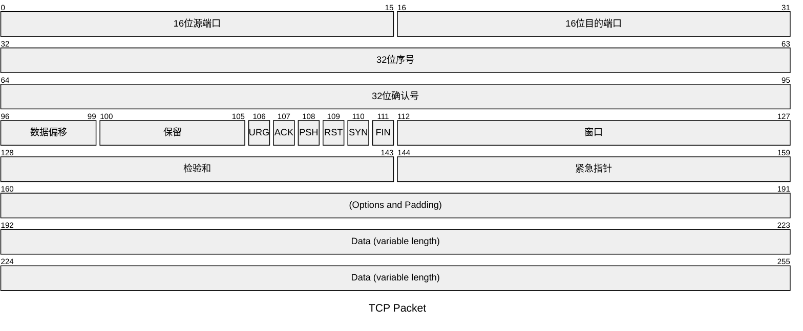
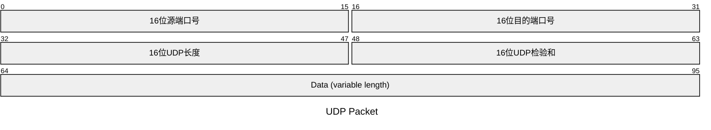

# 运输层/传输层

通信真正实体：端主机中的进程

运输层协议（端到端协议

运输层使用不同端口对应不同进程，网络层及其下层传输应用层报文，接收方运输层通过不同端口将报文交付给应用层的进程

运输层直接为应用进程间的逻辑通信提供服务，向高层用户屏蔽了下面网络核心的细节

> 传输层：提供进程和进程之间的逻辑通信，靠套接字Socket(ip+端口)找到应用进程
>
> 对收到的报文进行差错检验

## 端口、复用和分用

不同操作系统使用不同格式的进程标识符

16比特表示，

范围：0-65535

- 熟知端口号：0-1023
    - ftp：20/21
    - http：80
    - dns：53
- 登记端口号：1024-49151
- 短暂端口号：49152-65535

端口号只有本地意义

### TCP/IP应用层常用协议

在运输层使用upd协议

- RIP：520
- DNS：53
- TFTP：
- SNMP：
- DHCP：

在运输层使用tcp协议

SMTP：25	

FTP：21/20

BGP：179

HTTP：80

HTTPS：443  

网络层都是用IP协议，
IP数据包首部协议字段的值：表示数据载荷部分封装的是什么数据单元
17：UPD
6：TCP

​    

### 示例

## TCPUDP对比

### UDP

1. 无连接：随时发送数据
2. 支持单播、多播、广播（111多1全
3. 优缺点：不可靠无连接，时延小

### TCP

1. 面向连接
   数据传输前，必须使用三报文握手**建立连接**
   数据传输后，使用四报文挥手**释放连接**
2. 仅支持单播

> 数据块看作字节流，存储在发送缓存，根据发送策略提取字节构建TCP报文段发送
>
> 接收，取出数据载荷部分存储在接收缓存，将其中一些字节交付进程
>
> TCP面向字节流，  

## TCP

1. 面向连接，虚连接
2. 点对点
3. 可靠交付，无差错不丢失不重复，按序到达
4. 提供全双工服务
5. 发送缓存：准备发送的数据/已发送但未收到
6. 接收缓存：按序到达但违背接受的数据/不按序到达的数据

###  TCP过程

1. 建立连接
   1. 客户端发送连接请求报文，SYN=1，seq=x
   2. 服务端分配缓存和变量，返回确认报文段，SYN=1，ACK=1，seq=y，ack=x+1
   3. 客户端分配缓存和变量，也返回一个确认，可以携带数据
2. 数据发送
3. 释放连接
   1. 客户端发送释放报文段，停止发送数据，FIN=1，seq=u
   2. 服务器返回确认报文段，ACK=1，ack=u+1，seq=v
   3. 服务器发完数据，返回连接释放报文段，关闭TCP连接，FIN=1，ACK=1，seq=w，ack=u+1
   4. 客户端返回确认报文段，等待计时器设置的2MSL，连接关闭

### TCP流量控制

数据传输速度更快，导致接收方来不及接收，导致数据丢失，此时需要流量控制

滑动窗口机制

### TCP拥塞控制

> 防止过多数据注入网络，保证不过载

> [!note]
>
> 拥塞控制和流量控制区别：
>
> 流量控制针对点对点，拥塞控制涉及所有主机和路由器

> 1. 轮次n
> 2. 拥塞窗口cwnd：只要未拥塞，cwnd就增大，拥塞，cwnd减小
> 3. 慢开始门限ssthreach：慢开始算法过程中cwnd的上限值
>     1. cwnd小于门限，使用慢开始
>     2. cwnd大于门限，改用拥塞避免
>     3. cwnd等于门限，都可以使用，但通常使用拥塞避免
> 4. 发送窗口上限 =min[接收窗口，拥塞窗口]

算法：

1. 慢开始
    1. cwnd=1，2,4,8...
    2. (乘法减小)出现超时，门限设置为cwnd的一半

2. 拥塞避免，
    1. (加法增大)每经过一个rtt，cwnd+=1
    2. 出现超时，执行拥塞避免算法
    3. (乘法减小)出现超时，门限设置为cwnd的一半

3. 连续收到3个冗余ACK，快重传
4. 连续收到3个冗余ACK，执行快恢复：
    1. 乘法减小

#### 题目

> 假设该连接中双方商定的的MSS都是1000B，慢启动门限初始值为8000B，接收窗口足够大，如果在整个数据传送过程中，只有在第6个传输轮次中出现超时重传，其余都是正常的，则1-10轮拥塞窗口的大小分别是多少？每轮中的拥塞控制算法分别是什么
>
> |          |      |      |      | 达到门限 |      | 超时 |      |      |      |      |
> | -------- | ---- | ---- | ---- | -------- | ---- | ---- | ---- | ---- | ---- | ---- |
> | cwnd     | 1    | 2    | 4    | 8        | 9    | 10   | 1    | 2    | 4    | 5    |
> | ssthresh | 8    | 8    | 8    | 8        | 8    | 8    | 4    | 4    | 4    | 4    |
> |          |      |      |      |          |      |      |      |      |      |      |
>
> 

### TCP超时重传

### TCP可靠传输

> 网络层是提供尽力交付，不可靠传输，此时传输层使用TCP实现可靠传输
> 可靠：接收方进程从缓存区读出的字节流===发送方发出的字节流

1. 校验（检验和字段）：检验首部和数据
2. 序号：
3. 确认：接收方采用累计确认 
4. 重传：

### TCP运输连接管理

### TCP报文段首部格式

1. 20B固定部分（和IP一样）
2. 可变部分：选项+填充

|      | 大小  | 首部字段           | 描述                                                         |
| ---- | ----- | ------------------ | ------------------------------------------------------------ |
| 2B   | 16bit | 源端口             |                                                              |
| 2B   | 16bit | 目的端口           |                                                              |
|      |       |                    |                                                              |
| 4B   | 32bit | 序号               | 本报文段发送数据的第一个字节的序号                           |
| 4B   | 32bit | 确认号             | 期望接收下一个报文段的第一个数据字节的序号 确认号为N，N-1为止的数据都被正确收到 |
|      |       |                    |                                                              |
|      |       | 数据偏移(首部长度) | 数据位置到首部头的位置偏移=首部长度 单位4B，和IP数据报一致 |
|      |       | 数据保留           |                                                              |
|      |       |                    |                                                              |
|      |       | 窗口               |                                                              |
|      |       |                    |                                                              |
|      |       | 检验和             |                                                              |
|      |       | 紧急指针           |                                                              |

## UDP

### UDP数据报格式

## UDP检验
