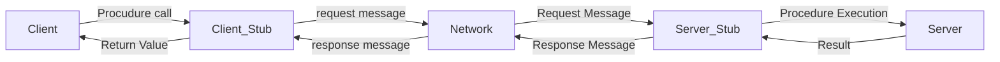
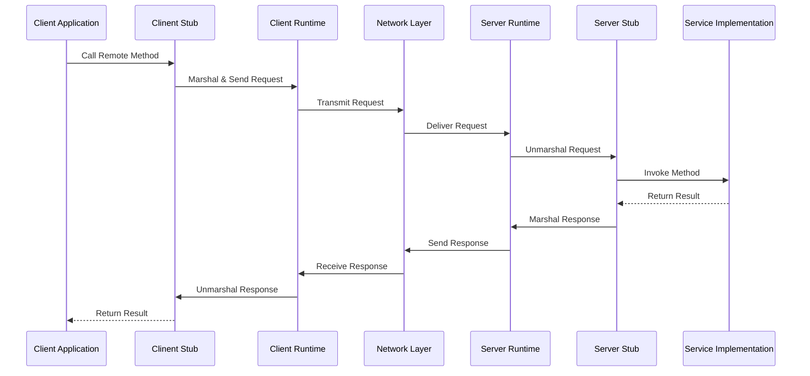
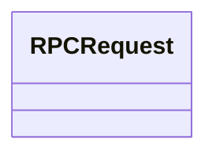

## RPC

1. https://web.eecs.umich.edu/~mosharaf/Readings/RPC.pdf

1. https://juejin.cn/post/7027422804668579870

remote procedure call 远程过程调用

像调用本地服务一样调用远程服务, 让调用者对网络通信这些细节透明

| **Course Goal 1****：** Understanding the purpose of the specified  protocol, including explain the specific role it plays within the application  and the problems it addresses. (20 Points) |
| ------------------------------------------------------------ |
| **Course  Goal 2****：** Understanding the corresponding code, including  the components that make up the code implementing protocol functionality, and  the specific functions of each part. (20 Points) |
| **Course  Goal 3****：**Master  the core data structure and implementation ideas of specific protocols. (20  Points) |
| **Course  Goal 4****：**Understand how the specified protocol  interacts with other protocols or other OSI layers. (20 Points) |
| **Course  Goal 5****：**Possess expression and word processing skills, able  to write reports with detailed and standardized report content. (20 Points) |

## 理解指定协议的目的，包括解释它在应用程序中发挥的特定作用及其解决的问题

1. 协议目的
2. 应用程序中发挥的特定作用
3. 解决的问题

## 理解相应的代码，包括构成实现协议功能的代码的组件，以及每个部分的特定功能

1. 实现协议功能代码的组件
2. 每个部分的特定功能

## 掌握特定协议的核心数据结构和实现思路

1. 协议核心的数据结构
2. 协议实现思路

## RPC如何与其他协议或其他OSI层交互

1. 介绍协议
    1. 目的
    2. 作用
    3. 解决的问题
2. 实现协议代码组件，部分功能
3. 协议的核心数据结构和实现思路
4. 协议如何与其他协议

