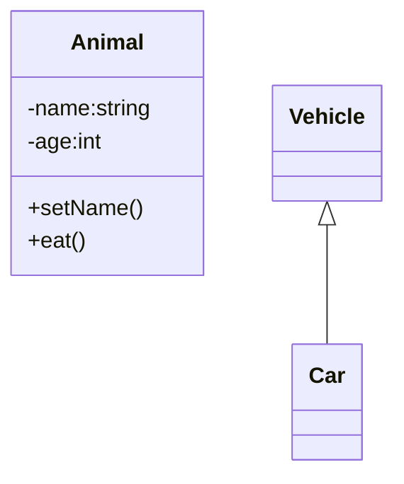
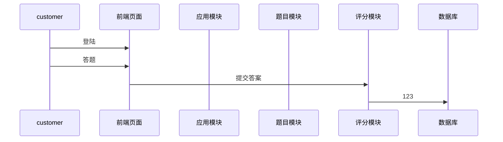

# UML图

1. 用例图：从用户角度描述系统功能
2. 类图：描述系统中类的静态结构
3. 对象图：系统中的多个对象在某一时刻的状态
4. 状态图：是描述状态到状态控制流，常用于动态特性建模
5. 活动图：描述了业务实现用例的工作流程
6. 顺序图：对象之间的动态合作关系，强调对象发送消息的顺序，同时显示对象之间的交互
7. 协作图：描述对象之间的协助关系
8. 构件图：一种特殊的UML图来描述系统的静态实现视图
9. 部署图：定义系统中软硬件的物理体系结构
10. 包图：对构成系统的模型元素进行分组整理的图
11. 时序图： 表示生命线状态变化的图
12. 组合结构图：表示类或者构建内部结构的图
13. 交互概览图：用活动图来表示多个交互之间的控制关系的图

## 类图

可见性符号

1. -private
2. +public
3. #protected
4. ~package/defalut

### 类之间关系

1. 继承：箭头
2. 关联：直线
3. 聚合：空心菱形
4. 组合：实心菱形
5. 繁华：
6. 依赖：

## 用例图

描述系统工作流程

1. 系统：矩形
2. 参与者
   1. 主要参与者：系统左边
   2. 次要参与者：系统右边
3. 用例：矩形内椭圆形，参与者和用例关联
4. 关系

## 时序图

显示系统内外交互过程

1. 参与者
2. 多个系统对象
3. 生命线
4. 消息：实线
5. 返回消息：虚线，用户对请求的响应
6. 请求消息：
7. 选择框：发送消息后多种情况，有多种返回消息

