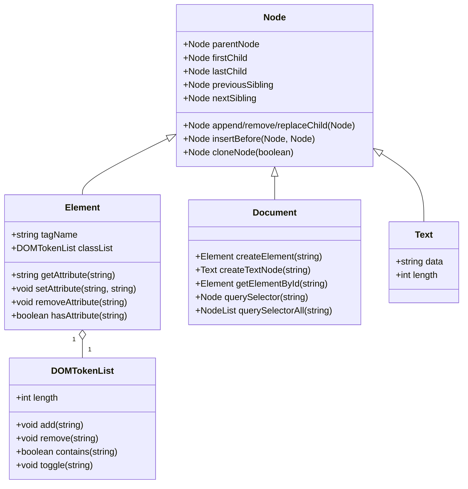

## DOM树和DOM节点

html → dom：https://software.hixie.ch/utilities/js/live-dom-viewer/

DOM树结构：标签为元素节点，构成一个树状结构
元素内部节点：文本节点

1. 节点层级：document根节点，html文档元素、其他元素
1. 每个节点都有nodeType属性：表示节点类型



### Node

属性：

1. `childNodes`: 实时的子节点NodeList
2. `first/lastChild`: 第一/最后一个子节点Node || null
3. `previous/nextSibling`: 同级的上/下一个节点 || null
4. `parentNode`: 父节点 || null
5. `parentElement`: 父节点Element
6. `textContent`: 所有子节点及其后代的文本内容
7. `nodeName`
8. `nodeType`
9. `nodeValue`

方法：

1. `append/remove/replaceChild()`
1. 
1. `contains()`

nodeType

| const                         | NodeType值 | 节点类型            | 描述                      | 示例             |
| ----------------------------- | ---------- | ------------------- | ------------------------- | ---------------- |
| ``                            |            | Node接口            | 所有节点类型都继承Node    |                  |
| `Node.ELEMENT_NODE`           | 1          | Element             | 最常用类型，DOM元素基础类 | div span         |
| `Node.TEXT_NODE`              | 3          | Text                |                           |                  |
| `Node.COMMENT_NODE`           | 8          | Comment             |                           |                  |
| `Node.DOCUMENT_NODE`          | 9          | Document            | 文档节点                  | 全局变量document |
| `Node.DOCUMENT_TYPE_NODE`     | 10         | DocumentType        |                           |                  |
| `Node.DOCUMENT_FRAGMENT_NODE` | 11         |                     |                           |                  |
| ``                            |            | 抽象类CharacterData |                           |                  |
| ``                            |            | HTMLElement         |                           |                  |
| ``                            | 3          | Text                | 元素内部文本，文本节点    | 我是文本         |

dom元素对象常见属性

| prop        |                            |      |
| ----------- | -------------------------- | ---- |
| innerHTML   | 将元素中的html获取为string |      |
| outerHTML   | innerHTML+元素本身=>string |      |
| textContent | 文字内容                   |      |

> 修改outerHTML会在dom中用新的值替换，但是旧的获取的值不会改变，如果还要操作替换的dom，需要重新获取dom

## Element

### 方法

```js
el.getBoundingClientRect()
```

> DOMRect
>
> 描述包含整个元素的最小矩形，对应的相关属性
>
> ```js
> {
>   bottom: 31.875
>   height: 22.5
>   left: 111.17708587646484
>   right: 180.80208587646484
>   top: 9.375
>   width: 69.625
>   x: 111.17708587646484
>   y: 9.375
> }
> ```
>
> 


 ## Document

```
document.all
document.images
document.forms
document.scripts
document.links
document.fonts

document.cookie
```

## XMLDocument

```js
var parser = new DOMParser();
var xmlDoc = parser.parseFromString(``)
```


## HTMLCollection/NodeList

HTMLCollection：Element子类集合

NodeList：所有Node子类集合

获取节点的子节点：

1. .children，返回HtmlCollection
2. .childNodes，返回NodeList


## 文本节点/注释节点

| prop           | 描述     |      |
| -------------- | -------- | ---- |
| nodeValue/data | 文本内容 |      |
|                |          |      |
|                |          |      |