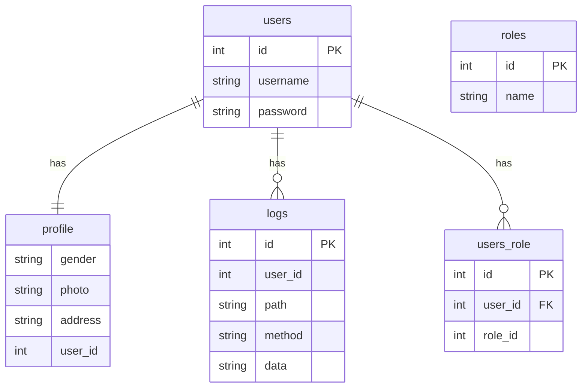

# 数据库设计

1. 需求分析
2. 逻辑设计
3. 数据库创建
4. 维护优化

## ER图

1. 矩形：实体
2. 椭圆形：字段/列/属性
3. 菱形：关系
    1. 一对一
    2. 一对多
    3. 多对多
4. 短线+数字：

> 属性key: 
>
> 1. PK主键
> 2. FK外键
> 3. UK唯一键

## 三大范式

第一范式: 属性具有原子性，不可再分解

第二范式: 记录的唯一性，记录有唯一标识，不能存在部份依赖
职工项目表 => 职工表和项目表

第三范式: 一个关系属于第二范式，且多个非主键属性不存在函数依赖

> 函数依赖：
>
> 传递依赖：非主键属性之间的函数依赖

> 学号 姓名 年龄 性别 院校 院校地址 院校电话
>
> 依赖传递：学号->学生
> 学院->学院电话
>
> 学生表，学院表

## 命名规范

英文、下划线或驼峰
必须使用小写字母，禁止数字开头，不使用拼音和英文缩写

1. 表名：customers
2. 字段名：customer_id

1. 索引名：idx_customer_id
2. 主键索引名：pk_字段名
3. 唯一索引名：uk_字段名

## 字段类型选择

1. 整数型：int/bigint
2. 浮点型：float/double
3. 字符型：varchar/char
4. 日期类型：datetime/date

### char vs varchar vs text

> varchar和char表示字符长度，其他类型的长度表示字节长度：char(10)表示10个字符，bigint(4)表示显示长度为4个字节
>
> 字段长度设置一般为2的n次方

char是定长，不满足值会自动填充

varchar是变长，

## 主键设计

唯一标识，数据操作和查询中起作用。

不能与业务关联，应使用自增id，分布式系统中使用优化的雪花id

## 优先考虑逻辑删除，而不是物理删除

物理删除缺点：

1. 数据恢复困难
2. 物理删除会导致索引树重构

## 每个表都需要添加通用字段

1. id：主键
2. create_time：
3. update_time：
4. creator：创建人
5. update_by：修改人，非必须
6. remark：数据记录备注，非必须

## 一张表的字段数量不要过多

尽量不超过20个

影响查询效率，占用更多存储空间，设计和维护变得更复杂

字段数量多可以考虑拆分：如计划表->计划表和计划详情表

