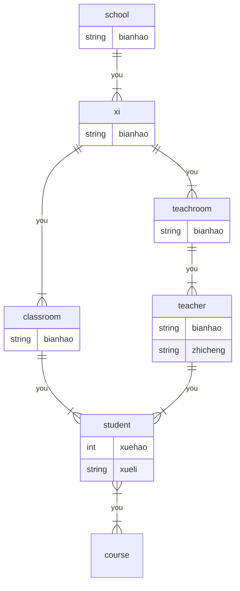
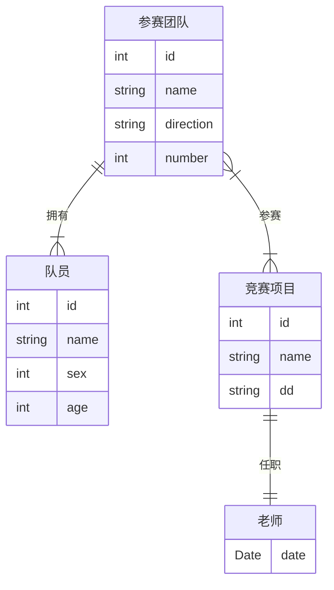

## 关系数据理论

1. 最小函数依赖集
2. 候选码
3. 范式
4. 分解无损性
5. 分解保持函数依赖

> 非平凡的函数依赖：`X -> Y, Y 不属于 X`
>
> 平凡的函数依赖：
>
> 部分函数依赖：
>
> 传递依赖：
> R，主键W，非主属性Z，Z属于X(非W)，若存在X->Z，则W->Z是传递依赖

> 关系模式R(ABCDE)
> F关系F{}
>
> 候选码：一个属性组，能退出所有的属性，且其任何自己都不能再推出所有属性
>
> 主码：多个候选码之一
> 超码：能推出所有属性的属性组集合，候选码是极小的超码
>
> 主属性：包含在候选码中的属性
> 非主属性：不包含在候选码中的属性
>
> ---
>
> 找候选码：
>
> 1. 一定是候选码的属性：只出现在左边/左右都不出现
> 2. 可能是：左右都出现
> 3. 不是：只出现在右边
>
> 4. 求一定是属性的闭包，能推出，则是
> 5. 否则，组合可能是候选码的属性，求闭包
>
> ---
>
> 求最小依赖集https://www.bilibili.com/video/BV1UL411k7Xs/?spm_id_from=333.337.search-card.all.click&vd_source=a6f0ee69351d992f6798c937a32c9968
>
> 1. 右侧划为单属性
>
> 2. 依次判断每个关系，用剩余关系求该关系的左侧属性闭包， 来决定是否删除
>     1. 闭包中包含被删除项右侧的属性，删除
>
> 3. 拆左边不是单属性的项
>
> 4. 删除一个属性，对另一个属性求闭包，看能否推出右边的属性
>
>     1. 能推出：删除
>
> ---
>
> 范式判断（每个范式都是在前一个的基础上
>
> 1NF：所有属性都不可分割
>2NF：不能有非主属性对码的部分函数依赖
> (所有非主属性都完全函数依赖于码)
> 
> 3NF：不能有非主属性对码的传递函数依赖
>传递函数依赖：非主属性C传递依赖于主属性A(A->B->C)，且B不能推出A
> 
> BCNF：所有依赖项的决定因素都必须为候选码
>(所有箭头的左边都是候选码)
> 
> ```
>该关系中每个属性都是原子的，达到1NF
> 所有非主属性都完全函数依赖于候选键，达到2NF
> 非主属性传递函数依赖于候选键，不能达到3NF
> ```
> 
> ----
>
> 分解成范式
>
> 2NF：
>
> 1. 把所有“部分依赖”的属性和对应的候选属性单独拿出来，组成新的关系。
>
> 无损3NF：
>
> 1. 求出最小函数依赖集
>2. 关系分解为关系模式：将每个箭头左右写成 R1(AD) R2...
> 3. 候选码是否在其中，如果不在，则补充一个候选键
> 
> BCNF:
>
> 1. 找F中一项不是候选键的项
>2. R1(AEF)
> 
> ---
>
> 判断分解 是否无损 是否保持函数依赖
>分解的无损连接性：https://www.bilibili.com/video/BV1jV411Y7Cx
> 
> 是否保持函数依赖：
>
> 1. 求F所有左属性的闭包
>2. 在Ri范围内，找Ri中存在的左侧属性，根据1中的闭包存在的写出单个右侧属性
>     1. 注：闭包中存在的右侧属性，也必须在Ri范围内
> 3. 将所有Fi取并集G，与F对比
>     1. F中存在G中不存在的依赖，就对该依赖的左属性在G中求闭包
>         1. 能推出，保持函数依赖
>         2. 不能推出，不保持

### 题目23 保持函数依赖


> 最小函数依赖集
>
> 1. 拆，ok
> 2. A->B
>     1. A+=A，没有B 不能删
> 3. CD->A
>     1. CD+=CD，没有A不能删
> 4. BC->D
>     1. BC+=BC，没有D
> 5. CE->D
>     1. CE+=CE
> 6. AE->F
>     1. AE+AEB
>
> 1. CD->A
>     1. D+=D,C+=C
> 2. BC->D
>     1. B+=B, C+=C
> 3. CE->D
>     1. C+=C，E+=E
> 4. AE->F
>     1. A+=AB, E+=E

```
会议名A 主持人B 时间C 会议室D 工号E 职务F
F{A->B CD->A BC->D CE->D AE->F}
最小函数依赖集: A->B CD->A BC->D CE->D AE->F
分解：R1(ABCD) R2(AEF)

候选键: CE
3NF:R1(AB) R2(ACD) R3(BCD) R4(CDE) R5(AEF)
```

> 是否保持函数依赖：
>
> 1. F所有左属性的闭包：
>     1. A+=AB
>     2. CD+=ABCD
>     3. BC+=ABCD
>     4. CE+=CED
>     5. AE+=ABEF
> 2. 求Fi：在Ri范围内，找Ri中存在的左侧属性，根据1中的闭包存在的写出单个右侧属性
>     1. 注：闭包中存在的右侧属性，也必须在Ri范围内
>     2. `F1(A->B, CD->A, CD->B BC->A BC->D)`
>     3. `F2(AE->F)`
> 3. 将所有Fi取并集`G={A->B, CD->A, CD->B BC->A BC->D,AE->F}`，与F对比
>     1. 找F中存在，G中不存在的依赖`CE->D`
>     2. 对该依赖的左属性**在G中求闭包**`CE+=CE`
>         1. 能推出右侧属性，保持函数依赖
>         2. 不能推出，不保持

### 题目-习题课ok


```
候选键：ADG
1NF: 存在非主属性B、C、E、F、H对键的部分依赖
3NF模式集：R1(AB) R2(BC) R3(CEF) R4(GH) R5(ADG)
```

### 题目-习题课


```
职工名A 项目名B 项目费C 部门名D 部门经理E
基本函数依赖FD{AB->C B->D D->E  }
候选键：AB (职工名A,项目名B)
R不是2NF：存在非主属性D、E对码B的部分依赖: B->D D->E 直接和间接部分依赖
2NF:
R1(ABC) 完全依赖主键的部分
R2(BDE) 部分依赖的部分
3NF: R1(ABC),R21(BD),R22(DE)
```

### 题目22

有如下结构的车险理赔关系 R(申请人编号，事故编号，事故地点，审批人工号，审批人姓名，赔款金额，支付方式) 已知：

1. 一起事故可以由不同申请人发起多笔理赔
2. 一名申请人可以申请多起事故的多笔理赔
3. 同一起事故由一名工作人员审批

(3) 判断分解ρ是否无损，说明理由：
(4) 求 R1 的函数依赖集 F1 和 R2 的函数依赖集 F2（直接给出结果）
(5) 判断分解ρ是否保持函数依赖，说明理由
(6) 将 R 无损且保持依赖地分解为 3NF 的模式集ρ，直接给出结果

```
申请人编号A，事故编号B，事故地点C，审批人工号D，审批人姓名E，赔款金额F，支付方式G
函数依赖集F{AB→FG B→C,B→D,D→E} 
候选键：AB
3NF:R1(ABFG) R2(BC) R3(BD) R4(DE)
最高属于1NF：存在非主属性事故地点，事故编号->事故地点，事故地点部分依赖于码，不满足2NF
```

```
ρ＝{
(申请人编号，事故编号，审批人工号，审批人姓名，赔款金额), 
(事故编号，事故地点，支付方式)
} 
```

### 题目1


```
员工编号A 日期B 零件数C 部门名称D 部门经理E R(A,B,C,D,E)
基本函数依赖：AB->C, A->D, D->E
候选码：AB
1NF，存在非主属性D对候选码的部分依赖
分解为2NF：
部分函数依赖A->D,R2(A->D,D->E),R1(AB->C,)
关系模式：R1(A,B,C)R2(A,D,E)
分解为2NF：R1(ABC) R2(ADE)
分解为3NF：R1(ABC) R2(AD) R3(DE)
```

### 题目2 BCNF


```
候选键：HS
R1(CT) F{A->B}
R2()
```


### 题目3 分解无损

设有关系模式R(A, B, C, D, E, , G) 其基本的函数依赖集`F=(A-→D ,B-→C,C→D D-→E,BC→F,AB-→G `
一个分解为`p={ R1(A, B, C, D) ,R2(C, E, F, G) }`。

```
候选键：AB
最高属于第（1 ）范式，说明理由：存在非主属性C,D对码的部分依赖
分解p是否保持函数依赖（不），是否无损（不），并说明理由：画出最终的表
将R无损且保持依赖地分解为3NF的模式集。β=（AD，ABG，CD，BCF，DE）
```

|      | A    | B    | C    | D           | E           | F    | G    |
| ---- | ---- | ---- | ---- | ----------- | ----------- | ---- | ---- |
| ABCD | a1   | a2   | a3   | a4          | b15<br />a5 | b16  | b17  |
| CEFG | b21  | b22  | a3   | b24<br />a4 | a5          | a6   | a7   |

1. 初始化表结构：一个属性为一列，分解中的一个模式为一行
2. 初始化表值：
    1. 属性在模式中存在，写入a，第几列就是a几
    2. 其余的：bij，按照行列写即可

3. A->D，看A列，找相同的行，相同的行看D列，
    1. 有a则都更新为a
    2. 都是b则更新为行下标最小的b
    3. 相同不用更新 
4. B->C，看B列，找相同的行，相同的行看C列
5. C->D
6. D->E
7. BC->F。看BC列，找完全相同的行，看F列
8. AB->G   看AB列，找完全相同的行，看G列
9. 继续扫描，直到完全static/一行变成a1a2a3a4a5...
10. 终止后，没有一行全是a，=》分解不具有无损连接

### 题目4 范式

在教学系统中，如果每门课只有一位教师上，每位教师只在一个系任教，
那么关系模式：课程（课程号，任课教师号，教师姓名，教师所在系）的候选键是什么？最高属于第几范式并说明理由。

```
课程号A 教师号B 教师姓名C 教师所在系D
F={A->B B->C B->D}
候选键: A
所有非主属性都完全函数依赖于候选键
非主属性C传递函数依赖于键，不能达到3范式
```

## SQL(关系数据操作)

> sql定义关键模式，完整性约束
>
> 关系代数实现查询
> sql实现查询

### 建表

```sql
// 创建表
CREATE TABLE 表名
(
  列名 数据类型 约束条件,
  cno char(10),
  sno char(14) not null,
	stuSex nchar(1) check(stuSex in ('男','女')) default '男',  
  // 表级完整性约束
  primary key(sno, tno),
  foreign key(sno) references student(sno),
  foreign key(tno) references student(tno),
  ON DELETE|UPDATE {NO ACTION|CASCADE|SET NULL| SET DEFAULT}
)
```

```sql
// 查询
select [ALL|DISTINCT] [] from []
where []
group by [] having []
order by [] [ASC|DESC]

where xx NOT BETWEEN 18 AND 20
where xx in ('3','5','7')
where xx like '欧阳_'
where xx='6' and xx >= 10
// 排序
order by Cno,Grade DESC
// 
select count(DISTINCT Sno)
// 分组，查各系的人数
select Sdept, COUNT(*) from s group by Sdept
// 对分组约束筛选
select sno from sc where grade >= 75 group by Sno having count(*) > 3
```

### 权限题

1. 

```sql
学生（学号，姓名，年龄，性别，家庭住址，班级号）
班级（班级号，班级名，班主任，班长）
GRANT <权限> ON TABLE [table] TO [user]
# 将角色R1授予用户U1.U1可继续授权给其他用户。
GRANT RT TO Ul WITH ADMIN OPTION
# 用户杨兰具有查询每个部门职工的最高工资、最低工资、平均工资的权限，他不能查看每个人的工资；
CREATE VIEW部 门工资统计(部门号，部门名，最高工资，最低工资,平均工资) AS
SELECT 部门.部门号，部门名，MAX(工资)，MIN(工资)，AVG(工资） FROM部门，职工
WHERE 部门.部门号,三职工.部门号
GROUP BY 部门.部门号，部门名 GRANT SELECT
ON TABLE 部门工资统计 TO 杨兰
```


### 题目22

一个学生可以参加多个社团，一个社团可以有多个学生参加。在学生表中删除一个元组时，必须同时把参与表中相关元组一起删除，参加年份只能在 2020 年（含）以后。学生（_学生编号，姓名，年龄，性别）社团（\_社团编号，名称，负责人编号）参与（社团编号，学生编号，参加年份）

```sql
# 1. 创建关系模式“参与”，需定义全部的完整性约束。
create table 参与(
	社团编号 char(3),
  学生编号 char(6),
  参加年份 INT CHECK(参加年份>=2020),
  primary key(社团编号,学生编号),
  # 删除学生/社团时，该表相关记录跟随删除
  foreign key(社团编号) references 社团(社团编号) ON DELETE CASCADE,
  foreign key(学生编号) references 学生(学生编号) ON DELETE CASCADE
)
#2. 查询没有参加任何社团的姓“王”的女学生姓名和年龄，按年龄降序排序。
SELECT 姓名, 年龄 FROM 学生 S
WHERE 性别 = '女' AND 姓名 LIKE '王%' AND NOT EXISTS (
      SELECT 1
      FROM 参与 P
      WHERE P.学生编号 = S.学生编号)
ORDER BY 年龄 DESC;
#3. 查询参加了全部社团的学生编号 
# 按照学生编号分组，
SELECT 学生编号 FROM 参与
GROUP BY 学生编号
HAVING COUNT(DISTINCT 社团编号) = (SELECT COUNT(*) FROM 社团);
#4. 统计参加人平均年龄大于 18 岁的社团编号，名称，平均年龄。
SELECT S.社团编号, S.名称, AVG(X.年龄) AS 平均年龄 FROM 社团 S
JOIN 参与 P ON S.社团编号 = P.社团编号
JOIN 学生 X ON P.学生编号 = X.学生编号
GROUP BY S.社团编号, S.名称
HAVING AVG(X.年龄) > 18;
#6. 创建一个新表，包含三个列：社团名称，负责人编号和参加人数，存入参加人数超过 100 人的社团的相关信息。
CREATE TABLE 大社团信息 AS
SELECT S.名称, S.负责人编号, COUNT(P.学生编号) AS 参加人数
FROM 社团 S
JOIN 参与 P ON S.社团编号 = P.社团编号
GROUP BY S.社团编号, S.名称, S.负责人编号
HAVING COUNT(P.学生编号) > 100;
#7. 把年龄在 18-20 岁的学生信息的查询权限授予数据库用户“U1”，并允许他将此权限转授他人
CREATE VIEW 青年学生 AS
SELECT * FROM 学生
WHERE 年龄 BETWEEN 18 AND 20;
GRANT SELECT ON 青年学生 TO U1 WITH GRANT OPTION;
```

### 题目23


```sql
一个学生可以报名参加运动会的多个项目比赛，一个项目可以有多个学生报名参与比赛。在学生表中删除一个元组时，必须同时把比赛表中相关元组一起删除。各编号均为长度为6的字符型数据，比赛得分为0-10分之间的短整数，不可以为空。
学生（学生编号，姓名，性别，身高，体重）
项目（项且编号，项目名称，裁判长）
比赛（项且编号，学生编号，得分）
请写出实现以下操作的SQL语句（注：各种名称必须用题干中给出的中文） 
#创建关系模式“比赛”，需定义全部的完整性约束。
CREATE TABLE 比赛 (
    项目编号 CHAR(6) NOT NULL,
    学生编号 CHAR(6) NOT NULL,
    得分 SMALLINT NOT NULL CHECK (得分 >= 0 AND 得分 <= 10),
    PRIMARY KEY (项目编号, 学生编号),
    FOREIGN KEY (项目编号) REFERENCES 项目(项目编号),
    FOREIGN KEY (学生编号) REFERENCES 学生(学生编号)
);
#查询比赛表中超过该项目平均得分的比赛信息。
SELECT * FROM 比赛 b1
WHERE 得分 > (
    SELECT AVG(得分)
    FROM 比赛 b2
    WHERE b2.项目编号 = b1.项目编号
);
#统计男学生平均身高超过1.7来的项目编号，项自名称，平均身高。
SELECT
    b.项目编号,
    p.项目名称,
    AVG(s.身高) AS 平均身高
FROM
    比赛 b
    JOIN 学生 s ON b.学生编号 = s.学生编号
    JOIN 项目 p ON b.项目编号 = p.项目编号
WHERE
    s.性别 = '男'
GROUP BY
    b.项目编号, p.项目名称
HAVING
    AVG(s.身高) > 1.7;
#统计每一个比赛项目参加的人数，要求显示项目编号，参加人数。人数超过3人的才统计；显示时，查询结果按照人数升序排列，人数相同，按照项目编号降序排列。
SELECT 项目编号, COUNT(*) AS 参加人数 FROM 比赛
GROUP BY 项目编号
HAVING COUNT(*) > 3
ORDER BY 参加人数 ASC,项目编号 DESC;
#删除项目名称为空或为“立定跳远”的所有比赛记录信息。
DELETE FROM 比赛
WHERE 项目编号 IN (
    SELECT 项目编号
    FROM 项目
    WHERE 项目名称 IS NULL OR 项目名称 = '立定跳远'
);
#创建视图：高个子学生信息，存放身高在1.8米以上的学生信息，将其查询权限及对身高的修改权限授予数据库用户“U1”，并允许他将此权限转授他人。
CREATE VIEW 高个子学生信息 AS
SELECT * FROM 学生
WHERE 身高 >= 1.8;
GRANT SELECT,UPDATE (身高) ON 高个子学生信息 TO U1 WITH GRANT OPTION;
```


### 题目-习题课

职工（_ 职工号，姓名，年龄，职务，工资，部门号）
部门（_ 部门号，部门名，经理名，电话）

用SQL语言定义这两个关系模式，要求：1）定义每个关系模式的主码；2）定义参照完整性约束；3）定义职工年龄不得超过60岁。

```sql
CREATE TABLE部门(
  部门号CHAR(4) PRIMARY KEY,
  部门名VARCHAR(40),
  经理名VARCHAR(10),
  电话VARCHAR(11));
CREATE TABLE 职工(
  职工号CHAR(10) PRIMAR YKEY,
  姓名VARCHAR(10),
  年龄 INT CHECK(年龄<=60),
  职务VARCHAR(10),
  工资FLOAT,
  部门号CHAR(4),
  FOREIGNKEY (部门号) REFERENCES部门(部门号));
# 选修全部课程的学生
SELECT SNAME FROM STUDENT,SC
WHERE STUDENT.SNO=SC.SNO
GROUP BY STUDENT.SNO,SNAME
HAVING COUNT(*)=(SELECTCOUNT(CNO)FROM COURSE);
```

### 题目-习题课

```sql
CREATE TABLE 销售（
  公司编号CHAR（1O），
  产品编号CHAR（8），
  计划量INT，
  PRIMARYKEY（公司编号，产品编号），
  FOREIGNKEY（公司编号）REFERENCES公司
  	ON DELETE CASCADE,
  FOREIGNKEY(产品编号）REFERENCES产品
  	ON DELETE RESTRICT,
	CHECK（计划量>=2000）
 );
```

### 题目-习题课1

```sql
# 供应商表：S(SNO,SNAME,STATUS,CITY)：
create table s(
	sno char(2) pk,
	sname varchar(10),
	_status char(2),
  city varchar(10));
# 零件表 P(PNO, PNAME, COLOR, WEIGHT): 
create table p(
  pno char(2) pk,
  pname varchar(10),
  color char(2),
  weight int);
# 工程项目表 J(JNO,JNAME,CITY)
create table j(
  jno char(2) pk,
  jname varchar(10),
  city varchar(10));
#供应情况表 SPJ(SNO,PNO,JNO,QTY)
create table spj(
  sno char(2),
  pno char(2),
  jno char(2),
  p k(sno,pno,jno),
  # 更新供应商信息是，供应记录跟随更新
  f k(sno) references s(sno) on update cascade,
  # 有供应记录的零件基本信息不允许删除
  f k(pno) references p(pno) on delete no action
)
```


## ER图(数据库设计)

> ER图基本结构
>
> 1. 矩形：实体
> 2. 菱形：关系
> 3. 椭圆：属性
>
> 规则：
>
> 1. 实体和实体通过-菱形-连接，代表关联，两边通过1/m/n阐述关系
> 2. 实体(矩形)/关系(菱形)都可以连接：-属性(椭圆)
>
> 画ER图流程
>
> 1. 确定实体
> 2. 确定对应的关系，用无向线条、基数、菱形连接
>     1. 一对一，1A 1B：B中引入A的外键，加入额外属性
>     2. 一对多，1A nB：B中引入A的外键
>     3. 多对多，mA，nB：新增SC(A,B,..)
> 3. 分析题目暗藏的属性，加上主码属性
> 4. 主码属性 + 下划线


### 题目23


### 题目22

某学科竞赛管理系统涵盖了如下的用户需求：有若干参赛团队，每个团队包括
团队编号、团队名、参赛方向、人数等属性；每个团队拥有若干队员，每个队员只
能加入一个团队，为便于管理，每个团队都指定一个队长负责竞赛事务管理；每个
队员有队员编号、姓名、性别、年龄等属性；有若干竞赛项目，包括项目号、名称、
竞赛地点、竞赛时间等属性；每个竞赛项目安排了一位老师作为项目负责人，记录
其任职年月；每个负责人只能负责一个项目；每个团队可参加多项竞赛，每个竞赛
项目可有多人参加，要求能够公布每个竞赛项目的参赛团队名次与成绩。请： 

学校有若干系，系有若干班级若干教研室，教研室有若干教员，有的教授和副教授会带若干研究生
每个班有若干学生，每个学生选修若干课程，每门课可被若干学生选修



ER图转化为关系模型

```yaml
系(/系编号， 系名， 学校名)

班级(/班级编号, 班级名, 系编号)
教研室(/教研室编号，教研室名，系编号)
学生(/学号，姓名，学历，班级编号，导师职工号)
课程(/课程编号, 课程名)
教员(/职工号, 姓名, 职称, 教研室编号)

# 多对多
选课(/学号，/课程编号，成绩)
```

### 题目-习题课

在校田径运动会中设置了各类比赛，每一比赛类别有类别编号、类别名称和主管等属性，
每一比赛类别包含很多比赛项目；每一比赛项目有项目编号、项目名称、比赛时间和级别等属性；
各个系团队有团编号、团名称、领队等属性，每一代表团有多名运动员组成
运动员有编号，姓名，年龄，性别等属性；每一名运动员可以参加多个比赛项目，每一比赛项目也有多名运动员参加，运动员参加比赛有成绩属性，成绩限定在0～7 分。


```sql
关系模式：
比赛类别（_类别编号，类别名称，主管）
比赛项目（_项目编号，项目名称、比赛时间，级别，类别编号）
系团队（_团编号，团名称，领队）
运动员（_运动员编号，姓名，年龄，性别, 团编号）
参加（_~项目编号，_~运动员编号，成绩）
CREATE TABLE 参加(
  项目编号 CHAR(7）NOT NULL,
  运动员编号 CHAR(6）NOT NULL,
  成绩INT
	PRIMARYKEY（项目编号，运动员编号） 
  FOREIGN KEY（项目编号） REFERENCES 比赛项目（项目编号）
  FOREIGN KEY（运动员编号） REFERENCES运动员(运动员编号）
	CHECK （成绩 BETWEEN 0 AND 7）
 );
```


### 题目2

> 某学科竞赛管理系统涵盖了如下的用户需求：有若干参赛团队，每个团队包括团队编号、团队名、参赛方向、人数等属性；每个团队拥有若干队员，每个队员只能加入一个团队，为便于管理，每个团队都指定一个队长负责竞赛事务管理；每个队员有队员编号、姓名、性别、年龄等属性；有若干竞赛项目，包括项目号、名称、竞赛地点、竞赛时间等属性；每个竞赛项目安排了一位老师作为项目负责人，记录其任职年月；每个负责人只能负责一个项目；每个团队可参加多项竞赛，每个竞赛项目可有多人参加，要求能够公布每个竞赛项目的参赛团队**名次与成绩**。请：
>
> （1）为该学科竞赛管理系统做概念设计，画出 E-R 图。（14 分）
>
> 若干参赛团队，团队有若干队员，队员只能加入一个团队
> 若干项目，项目有一个老师，一个老师只负责一个项目，项目可以被多人参加
> 团队可参加多个项目，
>
> （2）将 E-R 图转换成关系模式，并指出每个关系模式的主键(用单下划线)和外键(用波浪线)。（10 分）

> [!tip]
>
> 实体矩形，联系菱形，属性椭圆，矩形和菱形都可能有对应的属性
> 主键直线，外键波浪线



```
参赛团队(_编号，名称，方向，数量，~队长编号)
队员(_编号，名字，性别，年龄，~团队编号)
项目(_编号，名称，地点，~负责人编号)
老师(_编号，姓名，时间)
参赛(_~团队编号，_~项目编号，名次，成绩)
```

### 题目3 公司1n仓库1n职工

某商业集团有三个实体集。
一个是“公司”实体集，属性有公司编号、公司名、地址等。
二是“仓库”实体集，属性有仓库编号、仓库名、地址等。
三是“职工”实体集，属性有职工编号、姓名、性别等。
公司与仓库间存在“隶属”关系，每个公司管辖若干个仓库，每个仓库只属于一个公司管辖；
仓库与职工间存在“聘用”联系，每个仓库可聘用多个职工，每个职工只能在一个仓库工作，仓库聘用职工有聘期和工资。
画出ER图，并在图上注明属性、联系的类型。转换成关系模式集，并指出每个关系模式的主键和外键。

```
公司(_公司编号、公司名、地址)
仓库(_仓库编号、仓库名、地址、~公司编号)
职工(_职工编号、姓名、性别、~仓库编号，聘期，工资)
```


### 题目4 职工n1工厂mn产品

某企业集团有若干工厂，每个工厂生产多种产品，且每一种产品可以在多个工厂生产，每个工厂**按照固定的计划数量**生产产品；每个工厂聘用多名职工，且每名职工只能在一个工厂工作，工厂聘用职工有聘期和工资。
工厂的属性有工厂编号、厂名、地址
产品的属性有产品编号、产品名、规格
职工的属性有职工号、姓名、技术等级


```
关系模式：
职工（_职工号，姓名，技术等级，工厂编号，聘期，工资）外键：工厂编号
工厂（_工厂编号，厂名，地址）
产品（_产品号，产品名，规格）
生产（~工厂编号，~产品号，数量）	两个外键分别为：工厂编号，产品号
```


## 日志记录分析(事务)

> 一组事务的调度：一个事务内部的指令顺序必须保持不变
>
> 并行事务调度：可串行化，将所有可能的串行调度结果推演一遍，
>
> REDO重做：重做已提交事务的所有操作
> UNDO撤销/回滚：撤销/回滚未提交事务的所有操作
> 不需要处理：已经回滚+未开始的+处理过的
>
> 系统恢复顺序/策略：
>
> 1. 撤销/回滚 未提交
> 2. 重做已提交
> 3. 其他+检查点之前已经提交/回滚的不操作
>
> 求系统恢复后的值：看故障发生前谁提交了即可

### 题目22

| 序号 | 日志 | 序号 | 日志 |
| ---- | ---------------- | ---- | ------------------ |
| 1 | T1：开始 | 9 | 检查点 |
| 2 | T1：写 A，A=5 | 10 | T3：写 C，C=16 |
| 3 | T2：开始 | 11 | T2：回滚 |
| 4 | T2：写 B，B=10 | 12 | T3：写 B，B=15 |
| 5 | T1：写 C，C=8 | 13 | T4：开始 |
| 6 | T1：提交 | 14 | T3：提交 |
| 7 | T2：写 B，B=12 | 15 | T4：写 C，C=20 |
| 8 | T3：开始 | 16 | T4：写 B，B=18 |

（1）如果系统故障发生在 16 之后，系统恢复时哪些事务需要 REDO 处理？（2 分） 
（2）如果系统故障发生在 16 之后，系统恢复时哪些事务需要 UNDO 处理？（2 分）
（3）如果系统故障发生在 16 之后，系统恢复时哪些事务不需要处理？（2 分） 

看16之前：T1T3提交，T2回滚，T4未提交
根据重做已提交，撤销未提交，不需要处理：已经回滚+未开始的+处理过的
T1T3重做，T4撤销，T2不处理

（4）如果系统故障发生在 16 之后，写出系统恢复后 A、B、C 的值。（3 分） 
（5）如果系统故障发生在 12 之后，写出系统恢复后 A、B、C 的值。（3 分） 
（6）如果系统故障发生在 4 之后，写出系统恢复后 A、B、C 的值。（3 分）

16之前，T1T3提交
A=5，C=16，B=15

12之前：T1提交
A=5，B=0，C=8

4之前：A=0, B=0，C=0


### 题目23


```
```


### 题目-习题课


```
14之后 T1T3提交
A=8 B=7 C=11
12之后 T1提交
A=10 B=0 C=11
10 T1提交
A=10 B=0 C=11
9 T1提交
A=10 B=0 C=11
7 T1提交
A=10 B=0 C=11
5 没有提交
A=B=C=0
```


### 题目-习题课


```
23 T1检查点T2回滚检查点T3T6T8提交
T3T6T8重做，T4T5T7回滚，T1T2不操作
19 T1检查点T2回滚检查点T3
T3重做,T4T5T6T7T8回滚
T1T2不操作
```

