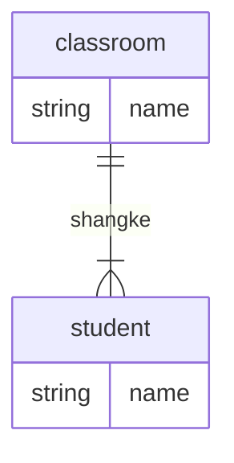
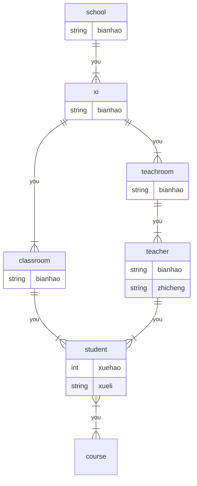

## ER

ER图基本结构

1. 矩形：实体
2. 菱形：关系
3. 椭圆：属性

规则：

1. 实体和实体通过-菱形-连接，代表关联
2. 实体/关系可以连接：-属性



### 题目：ER图转化为关系模型

画出ER图

1. 确定实体
2. 确定对应的关系
    1. 一对一，1 1
    2. 一对多，1，n
    3. 多对多，m，n
3. 分析题目暗藏的属性，加上主码属性
4. 主码属性 add 下划线

学校有若干系，系有若干班级若干教研室，教研室有若干教员，有的教授和副教授会带若干研究生
每个班有若干学生，每个学生选修若干课程，每门课可被若干学生选修



ER图转化为关系模型

```yaml
系(/系编号， 系名， 学校名)

班级(/班级编号, 班级名, 系编号)
教研室(/教研室编号，教研室名，系编号)
学生(/学号，姓名，学历，班级编号，导师职工号)
课程(/课程编号, 课程名)
教员(/职工号, 姓名, 职称, 教研室编号)

# 多对多
选课(/学号，/课程编号，成绩)
```

