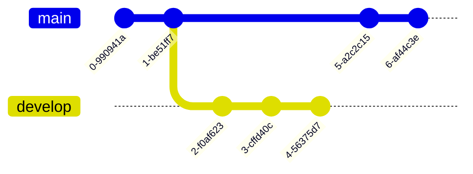

```
git init
git add .
git commit -m ""
git remote add origin [url]
git push -u origin main
```

## 初始化

`git init`

`git add .`添加到暂存区

`git commit -m ["note"]`

`git branch -M main`修改分支名

`git remote add origin [url]`

`git pull -u origin [远程分支](:[本地分支])`

`git pull origin [分支]`提交



## 信息查询

`git config --list`查询配置

`git branch`查看当前分支

`git status`仓库状态

`git log`提交记录

## .gitignore

```.gitignore
# dir 不需要提交的目录
/node_modules
​
# file 不需要提交的文件
config.ini
​
# log 不需要提交的任意包含后缀名为log的文件
*.log
​
# Package Files 不需要提交的任意包含后缀名为jar的文件
*.jar
```

`git rm --cached test.js`

>[frankiegao123](https://www.zhihu.com/people/d67b17f766b8694fe9ae0e91e4a8b538)
>
>.gitignore 前 push 了也可以忽略的，使用 git rm -r --cached . 然后 git add . 再 commit, push 就可以了。

### 本地合并多条commit

合并2条commit`git rebase -i HEAD~2`
弹出pick，将第二条及以下的pick改成s，即squash

可选操作：接着弹出一个文本，将被合并的commit信息删除或者注释掉

### git良好规范

- 频繁commit，谨慎push
