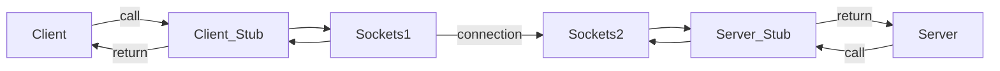

## 图类型

1. Flowchart 流程图
2. Sequence diagrams 时序图
3. Class diagrams
4. State diagrams
5. Entity Relationship Diagrams
6. 


## flowchart


```mermaid
flowchart LR
  Client -- call --> Client_Stub --> Sockets1 --> Client_Stub
  Client_Stub -- return --> Client

  Server -- call --> Server_Stub --> Sockets2 --> Server_Stub
  Server_Stub -- return --> Server

  Sockets1 -- connection --> Sockets2
```

```mermaid

```

